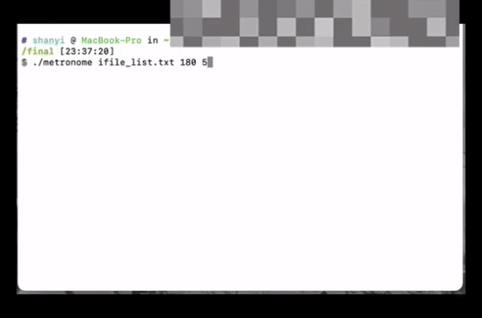
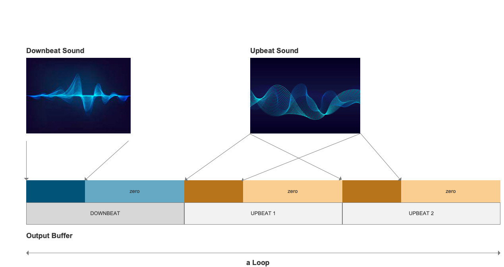

# Cple Metronome
## Description



This program is a simple metronome. Users can define beats per minute, beats per measure, and the upbeat/downbeat sound from the command line first.

Beats per minute(BPM) is a term used to describe the tempo. Beats per measure is another term, meaning the number of beats in every “loop”. The downbeat is commonly the first beat in each measure. The upbeat sound is the one that sounds lighter. For example, if a user sets beats per measure as three, then there will be a loop with one time downbeat and two times upbeat. The metronome is a very useful tool and can be used in music instrument practicing.

The range of beats per minute is [30, 280], while the range of beats per measure is [2,12]. If the input value is not in this range, the program will show an error with the corresponding information. The downbeat and upbeat sound should be short enough in order to play properly. If the number of samples in each sound file is larger than the number of samples in each beat, there will be error information.

The upbeat and downbeat sound can be defined by the user by editing the ifile_list.txt and signal menu. In
this file, users can define two `.wav` files, which are written in the format of `./signals/filename.txt`. Also,
users need to put the chosen file under the signal menu.



The samples in each loop are arranged by calculating samples in each beat and each loop based on user
input. The graph above shows the process. In each beat, we put the beat sound in the first half and set the
magnitude of the other half as zero. In addition, we decide whether the sound played is downbeat or
upbeat by determining whether it is the first beat of each loop.

𝑓𝑟𝑎𝑚𝑒𝑃𝑒𝑟𝐵𝑒𝑎𝑡 = 60 * 𝑠𝑎𝑚𝑝𝑙𝑒𝑅𝑎𝑡𝑒 / 𝑏𝑒𝑎𝑡𝑠𝑃𝑒𝑟𝑀𝑖𝑛𝑢𝑡𝑒

𝑓𝑟𝑎𝑚𝑒𝑃𝑒𝑟𝐿𝑜𝑜𝑝 = 𝑓𝑟𝑎𝑚𝑒𝑃𝑒𝑟𝐵𝑒𝑎𝑡 * 𝑏𝑒𝑎𝑡𝑠𝑃𝑒𝑟𝑀𝑒𝑎𝑠𝑢𝑟𝑒

𝑠𝑎𝑚𝑝𝑙𝑒𝑠𝑃𝑒𝑟𝐵𝑒𝑎𝑡 = 𝑓𝑟𝑎𝑚𝑒𝑃𝑒𝑟𝐵𝑒𝑎𝑡 * 𝑐ℎ𝑎𝑛𝑛𝑒𝑙𝑠

We can use the equations bove to calculate frames per beat, frames per loop and samples per beat.

## Signal Flow


In metronome.c:

* main()
  * Parses the command line
  * Check if the input value is within the range
  * Read the audio data from each file into its own buffer
  * Calculate frame per beat and frame per loop from input data
  * Allocate memory according to the length of the block (“loop”)
  * Free the memory space
* user_input()
  * Display essential information
  * User control play/stop/quit
* paCallback()
  * Reads a block of audio from the input file.
  * Construct the output block (“loop”) according to the user input
  * Put the upbeat and downbeat sound into the block at the corresponding place
  * Output the constructed loop

## Libraries
* Sndfile
* Portaudio

These libraries were obtained from brew:
```
Brew install sndfile
Brew install portlib
```

## Compilation and Linking
`Build.sh` can be directly used to compile and link the program on the OS X platform. Or we can also use
the following command line to compile:
```
gcc -Wall -o metronome metronome.c paUtils.c \
```

## Command Line
We can use the following command line format to run the program:

```
./metronome ifile.txt beatsPerMinute beatsPerMeasure inputfile.wav
```

Here are some examples:

```
./metronome ifile_list.txt 120 3
./metronome ifile_list.txt 180 5
```

The ifile_list.txt should be like:
```
./signals/sig1.wav
./signals/sig2.wav
```
